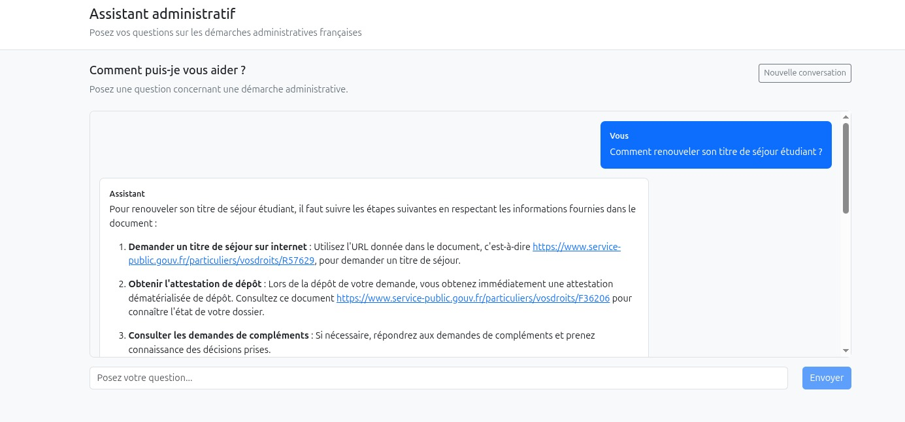
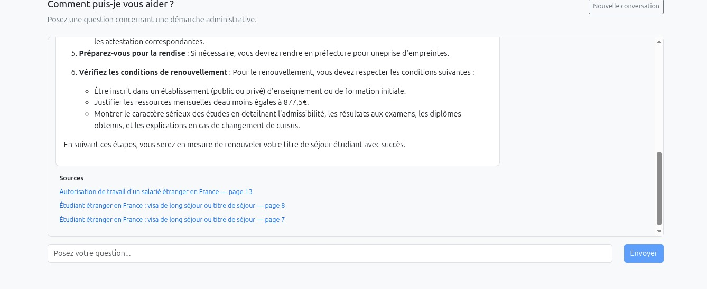

# RAG Admin Assistant Français

## Description

**RAG Admin Assistant** est une application web basée sur une architecture
**RAG (Retrieval-Augmented Generation)** permettant de répondre à des questions
sur les démarches administratives françaises à partir de documents officiels.

L'application recherche les informations pertinentes dans une base documentaire,
effectue un **reranking des résultats**, puis utilise un LLM local pour générer
une réponse contextualisée accompagnée des sources utilisées.

Un mécanisme de cache avec **Redis** permet également d'accélérer le traitement
des questions déjà posées.

---

## Aperçu

Exemple d'une question posée à l'assistant avec génération de la réponse et
affichage des sources utilisées :

---

## Sources de données

Les données utilisées par le système RAG proviennent de documents publics de
[Service-Public.fr](https://www.service-public.fr/), le site officiel de
l'administration française.

Le corpus couvre principalement les démarches administratives liées au séjour
des étrangers, au travail, au regroupement familial et à la naturalisation.

### Documents utilisés

- [Démarches en ligne sur l'ANEF : titres de séjour, changement de situation et naturalisation](https://www.service-public.fr/particuliers/vosdroits/R59398)
- [Carte de résident de longue durée - UE](https://www.service-public.fr/particuliers/vosdroits/F17359)
- [Visa de long séjour / VLS-TS](https://www.service-public.fr/particuliers/vosdroits/F16162)
- [Étudiant étranger en France : visa de long séjour ou carte de séjour](https://www.service-public.fr/particuliers/vosdroits/F2231)
- [Changement d'adresse et démarches ANEF](https://www.service-public.fr/particuliers/vosdroits/R59398)
- [Autorisation de travail d'un salarié étranger en France](https://www.service-public.fr/particuliers/vosdroits/F2728)
- [Regroupement familial](https://www.service-public.fr/particuliers/vosdroits/F11166)
- [Naturalisation française par décret](https://www.service-public.fr/particuliers/vosdroits/F2213)
- [Carte de séjour "vie privée et familiale" d'un étranger en France](https://www.service-public.fr/particuliers/vosdroits/F2209)

Les documents sont exploités au format PDF. Leur contenu est extrait,
découpé en chunks, vectorisé puis indexé dans **ChromaDB** afin d'être
interrogé par le pipeline RAG.

**Source :** Service Public — Direction de l'information légale et
administrative (DILA).

---

## Stack technique

### Intelligence artificielle / RAG

- **LangChain** — orchestration du pipeline RAG
- **DeepSeek-R1 7B** — génération des réponses
- **Ollama** — exécution locale du LLM
- **Sentence Transformers** — génération des embeddings
- **CrossEncoder** — reranking des documents récupérés
- **ChromaDB** — base de données vectorielle

### Backend

- **Python**
- **FastAPI**
- **Redis**

### Frontend

- **React**
- **Vite**
- **Bootstrap**
- **Axios**